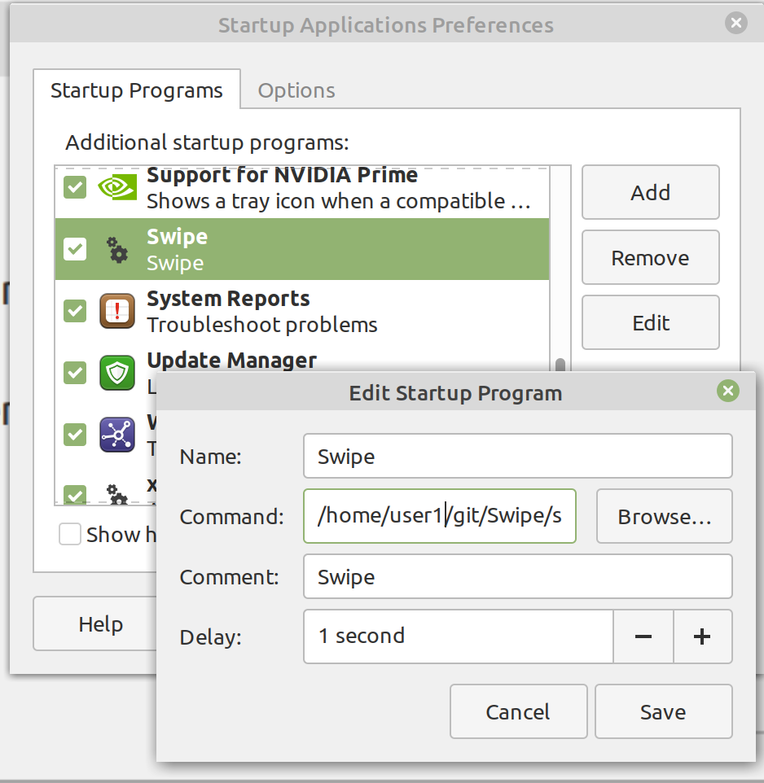

# Swipe
Gestures on Linux. 


<p>https://evuraan.info/Swipe/ 
 
## Screengrab:
-  [https://evuraan.info/evuraan/stuff/Swipe.mp4](https://evuraan.info/evuraan/stuff/Swipe.mp4) 
 
## Features
Swipe uses a novel yet simple correlation mechanism to determine directional intent from event coordinates.
- Wide range of devices supported 
- Touchscreens - single, double, triple, quad touches supported. 
- Touchpad - double, triple, quad touches 
- Wayland and X11 compatible
- Easy Installation - download (or git clone) and run. 
- No dependency on Python or Ruby
- Supports Config files
## Available variants/branches 
- Branch [modular](https://github.com/evuraan/Swipe/tree/modular) - Swipe/1.06e - Use with `xdotool` or [`edotool`](https://github.com/evuraan/edotool) or `ydotool` or `xte` etc. 
 
## Requirements 
- libinput-tools  
  ```bash 
    sudo apt-get install libinput-tools 
   ```
- Your user must be a member of `input` group:
  ```bash 
    sudo gpasswd -a $USER input
    newgrp input
    ```
- Optional: Enable touchpad events
  ```bash
    gsettings set org.gnome.desktop.peripherals.touchpad send-events enabled
     ```
## Setup
- Download `Swipe` to a folder. (Either download the latest build from the [bin folder](./bin/), or clone this repo, or download and extract the <a href="https://github.com/evuraan/Swipe/archive/refs/heads/main.zip">Zip file</a>.)
	<pre>
	$ wget https://github.com/evuraan/Swipe/blob/main/bin/swipe?raw=true -O swipe 
	$ chmod 775 swipe </pre>
- Launch `swipe`. In most cases `Swipe` will look for and find everything it needs, otherwise you can use the options and/or a config file.

See your distro's documentation to setup `Swipe` as a [`Startup Application`](./images/Startup.png) - an [application](./images/Startup.png) that starts when a desktop user logs in. 



## Usage:

```bash
$ ./swipe -h
Usage: ./swipe
  -h  --help             print this usage and exit
  -v  --version          print version information and exit
  -s  --sampleCfg        show sample config
  -d  --debug            show verbose output
  -c  /etc/ku.conf       config file to use 
  -k  --keys             show available keys
  -i  /dev/input/event1  kbd device to use
  -a  --available        show available devices
  -q  --noIndicator      disable status icon
```
- If no config file is specified, `Swipe` would use a default configuration. 
- If an appropriate `kbd` device cannot be found, `Swipe` will ask you to specify a suitable device using the `-i` option.

## Config
Generate a sample config file with  -s option:

```bash
$ ./swipe -s
Sample Config: 
# 2 Button Touchpad 
2right: "KEY_LEFTALT + KEY_LEFT"
2left:  "KEY_LEFTALT + KEY_RIGHT"

# 3 Button Touchpad Gestures:
3right: "KEY_LEFTALT + KEY_LEFT"
3left:  "KEY_LEFTALT + KEY_RIGHT"
3up:    "KEY_SPACE"
3down:  "KEY_LEFTSHIFT + KEY_SPACE"

# 4 Button Touchpad Gestures:
4right: "KEY_LEFTALT + KEY_LEFT"
4left:  "KEY_LEFTALT + KEY_RIGHT"
4up:    "KEY_HOME"
4down:  "KEY_END"

# 5 - Touchscreens
5right:      "KEY_LEFTALT + KEY_LEFT"
5left:       "KEY_LEFTALT + KEY_RIGHT"
5up:         "KEY_DOWN + KEY_DOWN + KEY_DOWN + KEY_DOWN + KEY_DOWN + KEY_DOWN"
5mediumUp:   "KEY_SPACE"
5mediumDown: "KEY_LEFTSHIFT + KEY_SPACE"
5down:       "KEY_UP + KEY_UP + KEY_UP + KEY_UP + KEY_UP + KEY_UP"
5fastup:     "KEY_SPACE"
5fastdown:   "KEY_LEFTSHIFT + KEY_SPACE"
	
```
## Debug option
Run with `-d` option to have debug info onto the terminal:
```bash
$ ./swipe -d -c /tmp/swipe.conf 
Fri Sep 03 19:07:12 2021 Swipe/3.01e Read 14 values from the config file
Fri Sep 03 19:07:12 2021 Swipe/3.01e 2 key touchpad events: map[LEFT:KEY_LEFTALT + KEY_RIGHT RIGHT:KEY_RIGHTALT + KEY_LEFT]
Fri Sep 03 19:07:12 2021 Swipe/3.01e 3 key touchpad events: map[DOWN:KEY_LEFTSHIFT + KEY_SPACE LEFT:KEY_LEFTALT + KEY_RIGHT RIGHT:KEY_LEFTALT + KEY_LEFT UP:KEY_SPACE]
Fri Sep 03 19:07:12 2021 Swipe/3.01e 4 key touchpad events: map[DOWN:KEY_END LEFT:KEY_LEFTALT + KEY_RIGHT RIGHT:KEY_LEFTALT + KEY_LEFT UP:KEY_HOME]
Fri Sep 03 19:07:12 2021 Swipe/3.01e touchscreen events: map[DOWN:KEY_UP + KEY_UP + KEY_UP + KEY_UP + KEY_UP + KEY_UP LEFT:KEY_LEFTALT + KEY_RIGHT RIGHT:KEY_LEFTALT + KEY_LEFT UP:KEY_DOWN + KEY_DOWN + KEY_DOWN + KEY_DOWN + KEY_DOWN + KEY_DOWN]
```
Desktop notifications ([example](./images/Debug.png)) are also enabled in debug mode - which shows the details of the event intercepted. 

## Keys and buttons supported:
Swipe supports about `482` keys/buttons - pretty much inline with Linux's [input-event-codes.h](https://github.com/torvalds/linux/blob/master/include/uapi/linux/input-event-codes.h). <br>  
Run `swipe -k` to see a full list:
```bash
$ ./swipe -k
Available keys:
key -->  KEY_FN_D
key -->  KEY_BRL_DOT8
key -->  KEY_HANJA
key -->  KEY_FILE
key -->  KEY_PHONE
key -->  KEY_ATTENDANT_ON
key -->  KEY_MACRO_PRESET1
key -->  KEY_KP5
key -->  KEY_PAGEUP
key -->  KEY_RIGHT
key -->  KEY_PRESENTATION
key -->  KEY_KBDINPUTASSIST_NEXT
key -->  KEY_FASTREVERSE
key -->  KEY_KP1
<snip>  
```

## Optional: Build 
If you prefer to build yourself, you will need the [Go Programming Language](https://golang.org/dl/) installed on your System. 

Go into the folder and build as: 
``` 
go build
```
